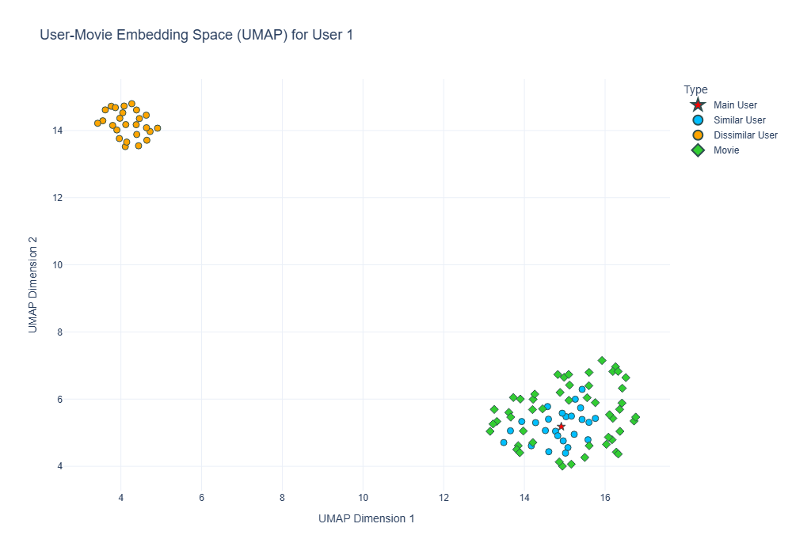

# Movie Recommender System with GNNs

This repository contains my project for the Exam of Information Retrieval @University of Trieste; it consists in the implementation of a Movie Recommender System using Graph Neural Networks (GNNs), specifically leveraging the LightGCN model. The system provides personalized movie recommendations based on user interactions and allows users to get recommendations for movies and users.

<div style="text-align: center;">
  
</div>

## Table of Contents
- [Features](#features)
- [Installation](#installation)
- [Usage](#usage)
- [Data](#data)
- [Model](#model)

## Features
- **User to Movie Recommendations**: Get the top 10 movie recommendations for a given user.
- **Movie to User Recommendations**: Get the top 10 user recommendations for a given movie.

## Installation

1. Clone the repository:
   ```bash
   git clone https://github.com/YuriPaglierani/Movie-Recommender-System-with-GNNs.git
   cd Movie-Recommender-System-with-GNNs
   ```

2. Create a virtual environment and install dependencies:
   ```bash
    conda env create -f environment.yml
    conda install pytorch-sparse -c pyg 
    conda install pytorch-cluster -c pyg
    ```

## Usage 

1. Train the model (optional, you need at least 1 GPU):
    ```bash
    python utils/train_test.py
    ```
2. Run the app (still in developement):
    ```bash
    python main.py
    ```
3. Make recommendations from terminal:
    ```bash
    python utils/recommend.py
    ```

Choose an option:
* 1: User to Movie
* 2: Movie to User

Enter the User ID or Movie ID as prompted to get recommendations.

## Data
The dataset used is the MovieLens 25M dataset, which includes 25 million user-movie interactions. The data is preprocessed and split into training and testing sets, through the files data/reviews.csv, and data/movies.csv

### Model
The model used is LightGCN, which is a Graph Neural Network model tailored for recommendation tasks. It effectively captures collaborative filtering signals by leveraging graph convolutions, for more details you can read the paper "LightGCN: Simplifying and Powering Graph Convolution Network for Recommendation"; to handle the big dataset I integrated LightGCN with the graph sampling technique shown in the paper "Cluster-GCN: An Efficient Algorithm for Training Deep and
Large Graph Convolutional Networks"
